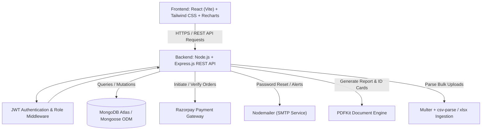
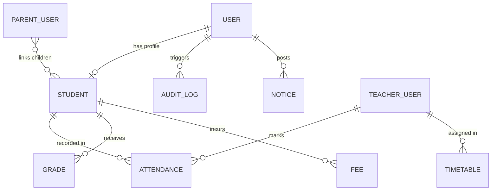
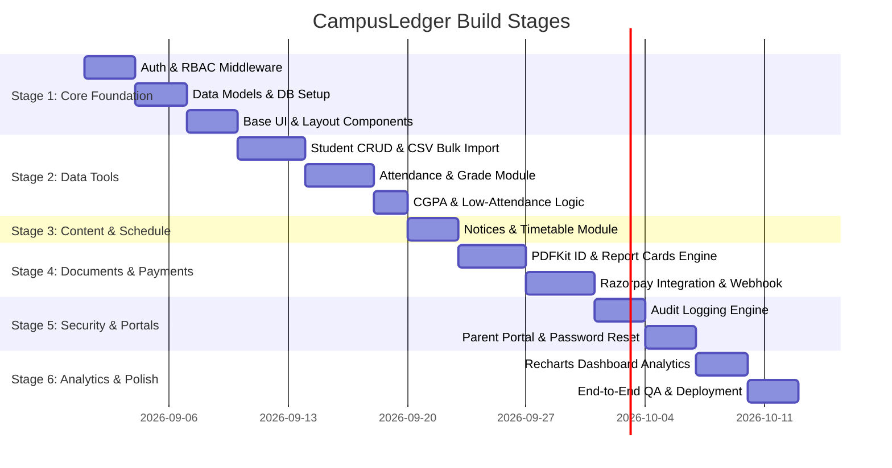

# CampusLedger - Student Management System (SMS)
## Comprehensive Technical Analysis & Project Architecture Document

---

## 1. Executive Summary & Overview

**CampusLedger** is a full-stack academic and institutional management platform built to digitize, centralize, and streamline core administrative and educational workflows in collegiate environments. 

Rather than serving as a standard CRUD application, CampusLedger provides an enterprise-ready portal featuring:
- **Role-Based Access Control (RBAC)** across 4 user tiers: **Admin**, **Teacher**, **Student**, and **Parent**.
- **Automated Academic Metrics**: Real-time CGPA computation, attendance analytics, and dynamic threshold alerts (<75% low attendance flags).
- **Transactional & Payment Systems**: End-to-end fee tracking, online payments via Razorpay (test/production), and automated cryptographic signature validation.
- **Document Generation**: Server-side programmatic PDF generation for Student ID cards and Academic Report Cards.
- **Auditing & Governance**: Immutable audit logging for security compliance and tracking operations across records.
- **High-Volume Data Ingestion**: Bulk student/faculty onboarding via CSV/Excel parsing.

---

## 2. Technical Stack Architecture



### Layered Breakdown

| Layer | Technologies / Libraries | Rationale & Characteristics |
| :--- | :--- | :--- |
| **Frontend** | React 18+ (Vite), Tailwind CSS, React Router v6, Recharts, Axios, Lucide Icons | High-performance SPA with rapid hot module replacement, utility-first responsive styling, dynamic statistical data visualizations, and modular routing. |
| **Backend** | Node.js, Express.js | Asynchronous, event-driven RESTful API service supporting modular controllers, middlewares, and services. |
| **Database** | MongoDB Atlas, Mongoose ODM | Document-oriented schema flexibility with Mongoose type casting, schema validation, population hooks, and indexing capabilities. |
| **Authentication & Security** | JWT (JSON Web Tokens), bcryptjs, Helmet, CORS, Express-Rate-Limit | Stateless authorization, salt-hashed credentials, RBAC route guards, and secure HTTP headers. |
| **File Processing & PDF** | Multer, csv-parse, xlsx, PDFKit | Memory/disk stream handling for bulk CSV/Excel onboarding and programmatic PDF compilation for ID cards and grade transcripts. |
| **Third-Party Integrations** | Razorpay SDK, Nodemailer | Cryptographically verified fee payments and asynchronous transactional email dispatch. |

---

## 3. Database Schema & Data Models

### 3.1 Entity Relationship Diagram (ERD)



### 3.2 Schema Specifications

#### 1. User Model (`User.js`)
* **`name`**: String (Required, Trimmed)
* **`email`**: String (Required, Unique, Indexed, Lowercase)
* **`password`**: String (Required, bcrypt hashed)
* **`role`**: Enum [`admin`, `teacher`, `student`, `parent`] (Default: `student`)
* **`profileRef`**: ObjectId (Ref to `Student` if role is `student`)
* **`linkedStudents`**: Array of ObjectIds (Ref to `Student`, utilized when role is `parent`)
* **`passwordResetToken`**: String (SHA-256 hashed)
* **`passwordResetExpires`**: Date
* **`isActive`**: Boolean (Default: `true`)
* **`timestamps`**: `createdAt`, `updatedAt`

#### 2. Student Model (`Student.js`)
* **`user`**: ObjectId (Ref: `User`, Required, Unique)
* **`name`**: String (Required)
* **`rollNumber`**: String (Required, Unique, Indexed)
* **`department`**: String (Required, Indexed)
* **`semester`**: Number (Required, Range 1-8)
* **`section`**: String (e.g., "A", "B")
* **`contact`**: Object { `phone`: String, `address`: String, `parentEmail`: String }
* **`photoUrl`**: String (URL to hosted profile image)
* **`admissionYear`**: Number
* **`timestamps`**: `createdAt`, `updatedAt`

#### 3. Attendance Model (`Attendance.js`)
* **`student`**: ObjectId (Ref: `Student`, Required, Indexed)
* **`subject`**: String (Required, Indexed)
* **`date`**: Date (Required, Indexed)
* **`status`**: Enum [`present`, `absent`, `excused`] (Required)
* **`markedBy`**: ObjectId (Ref: `User`, Required)
* **`semester`**: Number (Required)
* **Compound Index**: `{ student: 1, subject: 1, date: 1 }` (Unique constraint to prevent duplicate attendance entry per day)

#### 4. Grade Model (`Grade.js`)
* **`student`**: ObjectId (Ref: `Student`, Required, Indexed)
* **`subject`**: String (Required)
* **`examType`**: Enum [`Internal-1`, `Internal-2`, `Final`, `Practical`, `Assignment`]
* **`marksObtained`**: Number (Required, Min: 0)
* **`maxMarks`**: Number (Required, Default: 100)
* **`credits`**: Number (Required, Default: 3 or 4)
* **`semester`**: Number (Required, Indexed)
* **`gradedBy`**: ObjectId (Ref: `User`)
* **`timestamps`**: `createdAt`, `updatedAt`

#### 5. Fee Model (`Fee.js`)
* **`student`**: ObjectId (Ref: `Student`, Required, Indexed)
* **`title`**: String (e.g., "Semester 4 Tuition Fee", "Lab Fee")
* **`amount`**: Number (Required)
* **`dueDate`**: Date (Required)
* **`status`**: Enum [`unpaid`, `paid`, `partial`, `overdue`] (Default: `unpaid`)
* **`paidAmount`**: Number (Default: 0)
* **`paymentDetails`**: Object {
    * **`razorpayOrderId`**: String,
    * **`razorpayPaymentId`**: String,
    * **`razorpaySignature`**: String,
    * **`paidAt`**: Date,
    * **`receiptNumber`**: String (Unique)
  }
* **`timestamps`**: `createdAt`, `updatedAt`

#### 6. Notice Model (`Notice.js`)
* **`title`**: String (Required)
* **`body`**: String (Required)
* **`postedBy`**: ObjectId (Ref: `User`, Required)
* **`audience`**: Enum [`all`, `teachers`, `students`, `parents`, `department`]
* **`targetDepartment`**: String (Optional)
* **`isPinned`**: Boolean (Default: `false`)
* **`attachmentUrl`**: String (Optional)
* **`timestamps`**: `createdAt`, `updatedAt`

#### 7. Timetable Model (`Timetable.js`)
* **`department`**: String (Required)
* **`semester`**: Number (Required)
* **`section`**: String (Required)
* **`day`**: Enum [`Monday`, `Tuesday`, `Wednesday`, `Thursday`, `Friday`, `Saturday`]
* **`periods`**: Array of Objects:
    * **`periodNumber`**: Number
    * **`subject`**: String
    * **`teacher`**: ObjectId (Ref: `User`)
    * **`startTime`**: String (e.g., "09:00 AM")
    * **`endTime`**: String (e.g., "10:00 AM")
    * **`roomNumber`**: String
* **Compound Index**: `{ department: 1, semester: 1, section: 1, day: 1 }`

#### 8. AuditLog Model (`AuditLog.js`)
* **`user`**: ObjectId (Ref: `User`, Indexed)
* **`action`**: Enum [`CREATE`, `UPDATE`, `DELETE`, `LOGIN`, `PAYMENT`, `IMPORT`]
* **`entityType`**: Enum [`Student`, `Grade`, `Attendance`, `Fee`, `Notice`, `User`, `Timetable`]
* **`entityId`**: String / ObjectId
* **`details`**: Object (Diff payload or metadata summary)
* **`ipAddress`**: String
* **`timestamp`**: Date (Default: `Date.now`, Indexed)

---

## 4. Role-Based Access Control (RBAC) Matrix

| Feature / Resource | Admin | Teacher | Student | Parent |
| :--- | :---: | :---: | :---: | :---: |
| **User Account Management (Create/Deactivate)** | Full Control | ❌ | ❌ | ❌ |
| **Student Record Management** | Full CRUD + Bulk Import | Read Assigned | Read Own Profile | Read Linked Child |
| **Attendance Operations** | View / Override | Mark & Edit Subject | View Own & % | View Linked Child & % |
| **Grade Operations** | Full View / Admin Edit | Enter / Modify Marks | View Own & CGPA | View Linked Child & CGPA |
| **Fee Management** | Set Fees, View All, Reconcile | Read-Only (Students) | Pay Own & View Receipt | View Linked Child Fee |
| **Timetable Operations** | Full Control | Manage Assigned | View Class Timetable | View Child Timetable |
| **Notice Board** | Post / Edit / Delete All | Post Class Notices / View | View Audience Notices | View Audience Notices |
| **Audit Logs & Analytics** | Full Access | ❌ | ❌ | ❌ |
| **PDF Export (ID / Report Cards)** | Generate for Any | Class Report Cards | Download Own | Download Child's |

---

## 5. API Reference & Endpoint Specifications

### 5.1 Authentication & Profile
- `POST /api/auth/login` - Authenticate credentials, return JWT & user profile.
- `POST /api/auth/register` - `[Admin]` Create teacher/student/parent accounts.
- `POST /api/auth/forgot-password` - Generate reset token and email link via Nodemailer.
- `POST /api/auth/reset-password/:token` - Reset password using verified cryptographic token.
- `GET /api/auth/me` - Get current session payload from token.

### 5.2 Students Management
- `GET /api/students` - `[Admin, Teacher]` Search, filter by department/semester, with pagination.
- `POST /api/students` - `[Admin]` Create a single student profile and linked user account.
- `POST /api/students/import` - `[Admin]` Multipart upload for bulk CSV/XLSX processing.
- `GET /api/students/:id` - `[Admin, Teacher, Student (own), Parent (child)]` Retrieve student details.
- `PUT /api/students/:id` - `[Admin]` Update profile data.
- `DELETE /api/students/:id` - `[Admin]` Soft/Hard delete student record.
- `GET /api/students/:id/report-card` - `[Admin, Teacher, Student (own), Parent (child)]` Stream generated PDF report card.
- `GET /api/students/:id/id-card` - `[Admin, Student (own)]` Stream generated PDF student ID card.

### 5.3 Attendance
- `GET /api/attendance/:studentId` - Retrieve detailed attendance ledger, overall %, and low-attendance alert status.
- `POST /api/attendance` - `[Teacher]` Submit batch attendance records for a class/subject.
- `PUT /api/attendance/:id` - `[Teacher, Admin]` Update existing attendance status.
- `GET /api/attendance/summary/class` - `[Admin, Teacher]` Aggregated attendance metrics per class/subject.

### 5.4 Grades & CGPA
- `GET /api/grades/:studentId` - Fetch all grades, semester breakdowns, and computed GPA/CGPA.
- `POST /api/grades` - `[Teacher]` Add or update subject marks.
- `POST /api/grades/batch` - `[Teacher]` Upload or update marks in bulk for an entire section.

### 5.5 Fee Management & Payments
- `GET /api/fees/:studentId` - Retrieve fee ledger, dues, and payment records.
- `POST /api/fees` - `[Admin]` Assign new fee invoice to student(s).
- `POST /api/fees/:id/pay` - `[Student]` Initialize Razorpay order for an unpaid fee invoice.
- `POST /api/fees/verify-payment` - `[Student]` Verify Razorpay HMAC SHA256 signature and update fee status to `paid`.
- `GET /api/fees/:id/receipt` - Generate/download payment receipt.

### 5.6 Notices & Timetable
- `GET /api/notices` - Fetch filtered notice list based on authenticated user's role and department.
- `POST /api/notices` - `[Admin]` Broadcast new notice with target audience.
- `DELETE /api/notices/:id` - `[Admin]` Delete notice.
- `GET /api/timetable` - Retrieve relevant timetable matching user's class or teacher's schedule.
- `POST /api/timetable` - `[Admin, Teacher]` Create or update class period schedules.

### 5.7 Audit Trail & Parent Portal
- `GET /api/audit-logs` - `[Admin]` Paginated audit trail with date/action filters.
- `GET /api/parent/students` - `[Parent]` List all children linked to the parent account with summaries.

---

## 6. Critical Business Logic & Algorithms

### 6.1 CGPA & GPA Calculation Algorithm
Grade points are derived from standard 10-point scale academic criteria:

$$\text{Grade Point (GP)} = \begin{cases} 
10 & \text{Marks } \ge 90 \\
9 & 80 \le \text{Marks } < 90 \\
8 & 70 \le \text{Marks } < 80 \\
7 & 60 \le \text{Marks } < 70 \\
6 & 50 \le \text{Marks } < 60 \\
0 & \text{Marks } < 50 \text{ (Fail)}
\end{cases}$$

$$\text{Semester GPA} = \frac{\sum (\text{Grade Point}_i \times \text{Credits}_i)}{\sum \text{Credits}_i}$$

$$\text{Cumulative CGPA} = \frac{\sum_{\text{all semesters}} (\text{Grade Point}_j \times \text{Credits}_j)}{\sum_{\text{all semesters}} \text{Credits}_j}$$

### 6.2 Low Attendance Threshold Flagging
* **Calculation**: $\text{Attendance \%} = \left(\frac{\text{Classes Present}}{\text{Total Conducted Classes}}\right) \times 100$
* **Rule**: If $\text{Attendance \%} < 75.0\%$, the system flags `lowAttendanceWarning: true`.
* **Automated Effect**:
  * Highlights student in Teacher dashboard with warning indicators.
  * Sends proactive notification banner to Student and Parent dashboards.
  * Flags warning note on generated PDF Report Card.

### 6.3 Razorpay Payment Cryptographic Verification
To eliminate client-side tampering, all transactions follow server-side cryptographic HMAC-SHA256 signature verification:

$$\text{Generated Signature} = \text{HMAC-SHA256}(\text{order\_id} + "|" + \text{payment\_id}, \text{RAZORPAY\_KEY\_SECRET})$$

```javascript
const crypto = require('crypto');

function verifyPaymentSignature(orderId, paymentId, signature, secret) {
  const hmac = crypto.createHmac('sha256', secret);
  hmac.update(orderId + "|" + paymentId);
  const generatedSignature = hmac.digest('hex');
  return generatedSignature === signature;
}
```

---

## 7. Project Structure & Directory Layout

```
CampusLedger/
├── backend/
│   ├── config/
│   │   ├── db.js                 # MongoDB connection logic
│   │   ├── mailer.js             # Nodemailer transporter configuration
│   │   └── razorpay.js           # Razorpay SDK initialization
│   ├── controllers/
│   │   ├── authController.js     # Auth, login, password recovery
│   │   ├── studentController.js  # Student CRUD, import, PDF triggers
│   │   ├── attendanceController.js # Attendance marking & metrics
│   │   ├── gradeController.js    # Grades, GPA/CGPA computation
│   │   ├── feeController.js      # Fee generation & Razorpay verification
│   │   ├── noticeController.js   # Notice broadcasting
│   │   ├── timetableController.js# Timetable scheduling
│   │   └── auditController.js    # Audit log querying
│   ├── middleware/
│   │   ├── authMiddleware.js     # JWT verification
│   │   ├── roleMiddleware.js     # Role authorization guard
│   │   ├── auditLogger.js        # Automatic change interception
│   │   ├── errorHandler.js       # Centralized error handler
│   │   └── uploadMiddleware.js   # Multer file upload setup
│   ├── models/
│   │   ├── User.js
│   │   ├── Student.js
│   │   ├── Attendance.js
│   │   ├── Grade.js
│   │   ├── Fee.js
│   │   ├── Notice.js
│   │   ├── Timetable.js
│   │   └── AuditLog.js
│   ├── routes/
│   │   ├── authRoutes.js
│   │   ├── studentRoutes.js
│   │   ├── attendanceRoutes.js
│   │   ├── gradeRoutes.js
│   │   ├── feeRoutes.js
│   │   ├── noticeRoutes.js
│   │   ├── timetableRoutes.js
│   │   └── auditRoutes.js
│   ├── utils/
│   │   ├── cgpaCalculator.js     # CGPA math utility
│   │   ├── pdfGenerator.js       # PDFKit report card & ID card layout
│   │   ├── csvParser.js          # Ingestion pipeline for CSV/Excel
│   │   └── tokenHelper.js        # JWT creation & verification utilities
│   ├── seed.js                   # Seed initial admin & demo records
│   ├── server.js                 # Express server bootstrap
│   ├── package.json
│   └── .env.example
├── frontend/
│   ├── src/
│   │   ├── api/
│   │   │   └── axiosInstance.js  # Interceptors for JWT auth & error handling
│   │   ├── assets/               # Branding, logos, illustrations
│   │   ├── components/
│   │   │   ├── common/           # Button, Modal, DataTable, Input, Alert
│   │   │   ├── layout/           # Navbar, Sidebar, PageHeader, Footer
│   │   │   └── dashboard/        # StatCard, AttendanceChart, GradeTrendChart
│   │   ├── context/
│   │   │   └── AuthContext.jsx   # Global auth state & user session
│   │   ├── pages/
│   │   │   ├── auth/             # Login, ForgotPassword, ResetPassword
│   │   │   ├── admin/            # UserMgmt, StudentMgmt, FeeMgmt, AuditLogs
│   │   │   ├── teacher/          # AttendanceMarking, GradeEntry, MySchedule
│   │   │   ├── student/          # StudentDashboard, MyGrades, FeePayment
│   │   │   ├── parent/           # ParentDashboard, ChildOverview
│   │   │   └── shared/           # NoticeBoard, TimetableViewer
│   │   ├── App.jsx               # Route definitions & ProtectedRoute wrappers
│   │   ├── main.jsx              # React DOM render
│   │   └── index.css             # Tailwind CSS tokens & global styles
│   ├── index.html
│   ├── vite.config.js
│   ├── tailwind.config.js
│   ├── package.json
│   └── .env.example
└── CampusLedger.md               # System Architecture & Technical Documentation
```

---

## 8. Step-by-Step Implementation Roadmap



---

## 9. Security & Production Hardening Checklist

- [x] **Password Protection**: Passwords salted and hashed with `bcryptjs` (work factor $\ge 10$).
- [x] **Cryptographic Secret Verification**: Razorpay signatures verified server-side with `crypto.createHmac`.
- [x] **RBAC Enforcement**: Dual-layer verification — client UI checks for clean UX + backend route guards blocking unauthorized HTTP verbs.
- [x] **Rate Limiting**: Implementation of `express-rate-limit` on `/api/auth/*` routes to stop brute-force attacks.
- [x] **Sanitization & Input Validation**: Validation of incoming request bodies using Joi or express-validator to prevent NoSQL injection.
- [x] **CORS Origin Isolation**: Restrict allowed origins strictly to production frontend URL.
- [x] **Audit Trail Integrity**: Audit logs recorded for all state-changing actions (CREATE, UPDATE, DELETE).
- [x] **Environment Variable Hygiene**: All secrets (`JWT_SECRET`, `MONGO_URI`, `SMTP_PASS`, `RAZORPAY_KEY_SECRET`) isolated in `.env` files with zero leakage to version control.

---

*Documentation compiled and structured for CampusLedger.*
