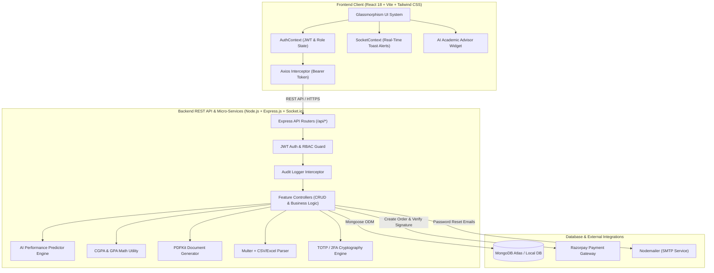

<div align="center">

# 🎓 CampusLedger
### Enterprise Academic Operating System & University ERP (v2.0)

[-61DAFB?logo=react&logoColor=black&style=for-the-badge)](https://reactjs.org/)
[](https://tailwindcss.com/)
[](https://nodejs.org/)
[](https://socket.io/)
[](https://www.docker.com/)
[](https://www.mongodb.com/)
[](https://razorpay.com/)
[](LICENSE)

<p align="center">
  A production-ready, full-stack university enterprise resource planning (ERP) platform featuring <strong>Multi-Role RBAC</strong>, <strong>AI-Driven Academic Diagnostics</strong>, <strong>Real-Time WebSockets</strong>, <strong>Assignments LMS</strong>, <strong>Placement & Career Cell</strong>, <strong>Hostel Facilities Management</strong>, <strong>Parent-Faculty Appointment Booking</strong>, and <strong>Automated Fee Reconciliation</strong>.
</p>

[Key Features](#-enterprise-feature-matrix) • [Architecture](#-system-architecture) • [Demo Logins](#-demo-credentials--1-click-switchers) • [Docker Deployment](#-docker-deployment) • [API Reference](#-complete-api-reference)

</div>

---

## 📑 Table of Contents

1. [Enterprise Feature Matrix](#-enterprise-feature-matrix)
2. [Demo Credentials & 1-Click Switchers](#-demo-credentials--1-click-switchers)
3. [System Architecture & Data Flow](#-system-architecture)
4. [Role Capabilities Breakdown](#-role-capabilities-breakdown)
5. [Complete API Reference](#-complete-api-reference)
6. [Docker & Local Setup Guide](#-installation--getting-started)
7. [Environment Variables Specification](#-environment-variables-specification)
8. [Security Governance & Auditing](#-security-governance--auditing)

---

## 🚀 Enterprise Feature Matrix

| Module | Purpose & Core Capabilities |
| :--- | :--- |
| **🤖 AI Study Advisor** | Server-side predictive engine forecasting semester CGPA, academic backlog probability, and subject-specific remediation roadmaps. |
| **📚 Coursework LMS** | Assignment publishing, student file submissions, deadline countdown timers, and faculty rubric grading. |
| **💼 Placement & Career Cell** | Corporate recruitment drives, automated CGPA eligibility validation, 1-click applications, and interview round tracking. |
| **🏢 Hostel & Maintenance** | Dormitory block & room inventory, bed occupancy management, and student repair ticketing with priority queues. |
| **📅 Parent-Faculty Scheduler**| 1-on-1 consultation booking with Google Meet links, discussion agendas, and faculty approval workflows. |
| **⚡ Real-Time WebSockets** | Bi-directional `Socket.io` event stream broadcasting live circulars, grade releases, and attendance alerts with floating toasts. |
| **📖 Library Center** | Book cataloging by shelf location (`Stack CS-101`), real-time stock counters, reservations, and returns. |
| **💳 Razorpay Invoicing** | Digital fee invoicing, online settlement, and server-side HMAC-SHA256 cryptographic verification. |
| **📄 Programmatic PDF Engine**| Server-side vector PDF generation for official Student ID Cards and Multi-Semester Academic Transcripts. |
| **📁 CSV Roster Ingestion** | Bulk stream-processing of `.csv` and `.xlsx` files to onboard hundreds of students in seconds. |
| **🔒 Two-Factor Auth (2FA)** | Time-based One-Time Password (TOTP) protection compatible with Google Authenticator and Authy. |

---

## ⚡ Demo Credentials & 1-Click Switchers

The login screen at `http://localhost:5173/login` features **1-Click Autofill Buttons** for instant evaluation:

| Role | Demo Email | Password | Primary Capabilities & Scope |
| :--- | :--- | :--- | :--- |
| **👑 Admin** | `admin@campusledger.edu` | `Admin123!` | Institutional analytics, user provisioning, CSV import, fees, placements, hostel tickets, audit trail |
| **👨‍🏫 Teacher** | `dr.sharma@campusledger.edu` | `Teacher123!` | Class rosters, roll call register, marks entry with auto-GPA, LMS assignments, parent meetings |
| **🎓 Student** | `alex.morgan@campusledger.edu` | `Student123!` | **AI Performance Advisor**, `<75%` attendance alerts, coursework submissions, placement drives, hostel repairs, fees, library |
| **👨‍👩‍👧 Parent** | `parent.morgan@campusledger.edu` | `Parent123!` | Multi-child switcher tabs, **AI Advisor for child**, attendance reports, consultation bookings |

---

## 🏗️ System Architecture



---

## 📡 Complete API Reference

### 📚 Coursework & LMS (`/api/assignments`)
| Method | Endpoint | Authorization | Description |
| :--- | :--- | :--- | :--- |
| `GET` | `/api/assignments` | Authenticated | List assignments filtered by department & semester |
| `POST` | `/api/assignments` | Teacher, Admin | Publish new assignment with deadline & max marks |
| `POST` | `/api/assignments/:id/submit` | Student | Submit solution summary & file attachment URL |
| `GET` | `/api/assignments/:id/submissions` | Teacher, Admin, Student | View student submissions for an assignment |
| `POST` | `/api/assignments/submissions/:id/grade` | Teacher, Admin | Enter marks and rubric feedback |

### 💼 Career & Placements (`/api/placements`)
| Method | Endpoint | Authorization | Description |
| :--- | :--- | :--- | :--- |
| `GET` | `/api/placements/drives` | Authenticated | List active, upcoming, and closed recruitment drives |
| `POST` | `/api/placements/drives` | Admin | Post new corporate recruitment drive |
| `POST` | `/api/placements/apply` | Student | Apply to drive (with automated CGPA eligibility check) |
| `GET` | `/api/placements/my-applications` | Student, Admin | List submitted applications and round statuses |
| `PATCH`| `/api/placements/applications/:id/status`| Admin | Update interview round & offer status |

### 🏢 Hostel & Maintenance (`/api/hostel`)
| Method | Endpoint | Authorization | Description |
| :--- | :--- | :--- | :--- |
| `GET` | `/api/hostel/rooms` | Authenticated | View dormitory room blocks & bed occupancy |
| `GET` | `/api/hostel/tickets` | Authenticated | View facility maintenance repair tickets |
| `POST` | `/api/hostel/tickets` | Student | Raise repair ticket (Electrical, Plumbing, AC, etc.) |
| `PATCH`| `/api/hostel/tickets/:id/resolve` | Admin | Resolve ticket and log resolution notes |

### 📅 Consultations (`/api/appointments`)
| Method | Endpoint | Authorization | Description |
| :--- | :--- | :--- | :--- |
| `GET` | `/api/appointments` | Authenticated | List scheduled parent-teacher meetings |
| `POST` | `/api/appointments` | Parent | Request 1-on-1 consultation slot with faculty |
| `PATCH`| `/api/appointments/:id/status` | Teacher, Admin | Confirm appointment & attach Google Meet link |

---

## 🐳 Docker Deployment

You can deploy the entire stack (MongoDB + Backend API + React Frontend) with a single command:

```bash
# Clone the repository
git clone https://github.com/amruthck177/Student_management_system.git
cd Student_management_system

# Launch containerized cluster
docker-compose up --build -d
```

- **Frontend Application**: `http://localhost:5173`
- **Backend API**: `http://localhost:5000`
- **MongoDB Database**: `localhost:27017`

---

## 🛠️ Local Development Setup

### 1. Backend Setup
```bash
cd backend
npm install
cp .env.example .env
npm run seed      # Seeds users, grades, library, LMS, placements, hostel
npm run dev       # Starts server on http://localhost:5000
```

### 2. Frontend Setup
```bash
cd frontend
npm install
npm run dev       # Starts UI on http://localhost:5173
```

---

## 📄 License

This project is licensed under the **MIT License**.

<div align="center">
  <sub>CampusLedger Enterprise v2.0 • Built for Modern Collegiate Institutions</sub>
</div>
