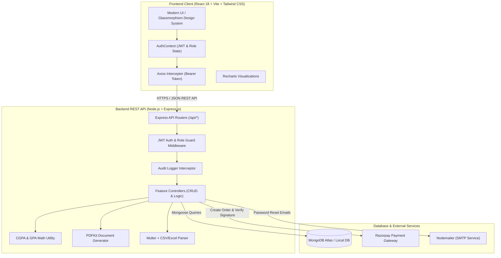
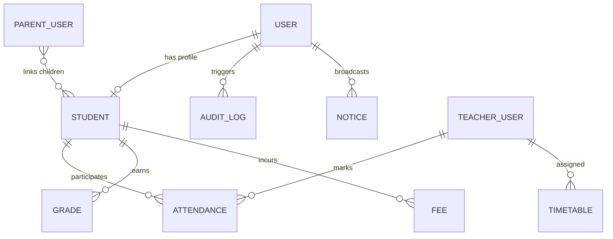

<div align="center">

# 🎓 CampusLedger
### Modern Academic Management & Institutional Operating System

[-61DAFB?logo=react&logoColor=black&style=for-the-badge)](https://reactjs.org/)
[](https://tailwindcss.com/)
[](https://nodejs.org/)
[](https://www.mongodb.com/)
[](https://razorpay.com/)
[](LICENSE)

<p align="center">
  A production-grade, full-stack collegiate administration portal engineered to streamline academic record-keeping, attendance tracking, marks grading, online fee settlements, circular broadcasts, and document generation with strict <strong>Role-Based Access Control (RBAC)</strong>.
</p>

[Key Features](#-key-features--role-capabilities) • [System Architecture](#-system-architecture) • [Demo Logins](#-demo-accounts--quick-switchers) • [API Documentation](#-complete-api-reference) • [Setup Guide](#-installation--getting-started)

</div>

---

## 📑 Table of Contents

1. [Executive Summary](#-executive-summary)
2. [Demo Accounts & 1-Click Role Switchers](#-demo-accounts--quick-switchers)
3. [Key Features & Role Capabilities](#-key-features--role-capabilities)
4. [System Architecture & Data Flow](#-system-architecture)
5. [Technology Stack](#-technology-stack)
6. [Database Models & Entity Relationships](#-database-models--schema-specs)
7. [Mathematical Algorithms & Business Logic](#-core-algorithms--business-logic)
8. [Complete API Reference](#-complete-api-reference)
9. [Project Directory Structure](#-project-directory-structure)
10. [Installation & Getting Started](#-installation--getting-started)
11. [Environment Variables Specification](#-environment-variables-specification)
12. [Bulk CSV Ingestion Format](#-bulk-csv-ingestion-format)
13. [Security & Compliance Hardening](#-security--compliance-hardening)
14. [Testing & Quality Assurance](#-testing--quality-assurance)

---

## 🌟 Executive Summary

**CampusLedger** digitizes the entire lifecycle of collegiate administration into a centralized, real-time web portal. Rather than a basic CRUD application, CampusLedger provides:

- 🛡️ **Multi-Tier RBAC**: Isolated dashboards and route guards for **Admins**, **Teachers**, **Students**, and **Parents**.
- 📊 **Automated Academic Metrics**: Real-time 10-point scale GPA / CGPA computation and `<75%` low-attendance warning triggers.
- 💳 **Cryptographic Payment Gateway**: Server-side HMAC-SHA256 signature verification for Razorpay fee settlements.
- 📄 **Programmatic PDF Documents**: Server-side rendering with PDFKit for official ID Cards and Academic Report Cards.
- 📁 **High-Throughput Data Ingestion**: Multer + stream parsing for bulk CSV/Excel student rosters.
- 📜 **Security Governance**: Immutable audit logging recording who performed create, edit, or delete actions across records.

---

## ⚡ Demo Accounts & Quick Switchers

The portal at `http://localhost:5173/login` includes **1-Click Autofill Demo Buttons** for instant evaluation across all roles:

| Role | Demo Email | Password | Primary Capabilities & Access Scope |
| :--- | :--- | :--- | :--- |
| **👑 Admin** | `admin@campusledger.edu` | `Admin123!` | Institutional analytics, user provisioning, student directory, CSV bulk import, fee reconciliation, audit trail |
| **👨‍🏫 Teacher** | `dr.sharma@campusledger.edu` | `Teacher123!` | Class rosters, interactive roll-call attendance register, marks entry with automatic 10-point GPA |
| **🎓 Student** | `alex.morgan@campusledger.edu` | `Student123!` | Attendance analytics with `<75%` warnings, semester transcripts, Razorpay online payments, PDF downloads |
| **👨‍👩‍👧 Parent** | `parent.morgan@campusledger.edu` | `Parent123!` | Multi-child switcher tabs, linked student attendance reports, academic transcripts, and fee status |

---

## 🚀 Key Features & Role Capabilities

### 👑 Administrator Console
- **Institutional Dashboard**: Real-time analytical widgets powered by Recharts (attendance longitudinal trends, fee collection breakdowns, departmental enrollment distribution).
- **User Provisioning & Access Control**: Create, activate, or suspend Teacher, Student, and Parent accounts.
- **Scholar Record Directory**: Add, update, search, and delete student records with multi-criteria filtering.
- **Bulk CSV / Excel Ingestion**: Stream-parse `.csv` and `.xlsx` rosters to enroll hundreds of scholars in seconds.
- **Fee Management**: Create, assign, and reconcile tuition invoices and view digital receipts.
- **Security Audit Trail**: Inspect an immutable history of every mutation made across the system.
- **Campus Notice Broadcasting**: Publish prioritized and pinned circulars to the entire institution or specific roles.

### 👨‍🏫 Faculty / Teacher Console
- **Assigned Class Rosters**: Filterable roster of assigned scholars with `<75%` low-attendance warning badges.
- **Interactive Roll-Call Register**: Take session attendance with instant "Mark All Present" / "Mark All Absent" toggles and absence remarks.
- **Grade & Marks Entry Sheet**: Enter internal/final exam marks with real-time grade letter and grade point feedback.
- **Schedule Viewer**: Access assigned weekly timetable and laboratory sessions.

### 🎓 Scholar / Student Console
- **Attendance Monitor**: Subject-wise percentage breakdown with automated **`<75%` Low Attendance Alert Banners**.
- **Semester Transcripts & CGPA**: Certified exam marks, credit weightages, and 10-point scale cumulative CGPA.
- **Online Fee Invoicing**: Pay outstanding semester fees via integrated Razorpay gateway and retrieve receipts.
- **Official PDF Credentials**: 1-click generation and download of **Student ID Cards** and **Semester Report Cards**.
- **Personalized Schedule & Circulars**: View relevant class timetables and campus announcements.

### 👨‍👩‍👧 Parent / Guardian Portal
- **Multi-Child Switcher Tabs**: Seamlessly toggle between multiple linked children from a single parent account.
- **Child Academic Transcript**: Inspect child's semester marks, credits earned, and computed CGPA.
- **Attendance & Compliance Monitoring**: Real-time alerts if a child falls below the mandatory 75% attendance threshold.
- **Fee Transparency**: Track paid and pending fee balances for linked scholars.

---

## 🏗️ System Architecture



---

## 💻 Technology Stack

```
+-------------------------------------------------------------------------+
|                              CAMPUSLEDGER                               |
+-------------------+--------------------+--------------------------------+
| LAYER             | TECHNOLOGY         | PURPOSE                        |
+-------------------+--------------------+--------------------------------+
| Frontend Framework| React 18 (Vite)    | High-performance SPA           |
| Styling & UI      | Tailwind CSS       | Responsive dark design system  |
| Icons & Visuals   | Lucide-React       | Modern iconography             |
| Analytics         | Recharts           | Interactive data visualizers   |
| HTTP Client       | Axios              | Interceptors & Bearer tokens   |
| Backend Runtime   | Node.js            | Asynchronous server runtime    |
| API Framework     | Express.js         | Modular RESTful endpoints      |
| Database          | MongoDB (Mongoose) | Document store & indexing      |
| Authentication    | JWT & bcryptjs     | Stateless authorization        |
| PDF Engine        | PDFKit             | Server-side vector PDFs        |
| Payments          | Razorpay SDK       | Card/UPI gateway integration   |
| File Processing   | Multer, csv-parse  | Bulk Excel/CSV onboarding      |
+-------------------+--------------------+--------------------------------+
```

---

## 🗄️ Database Models & Schema Specs



### Schema Field Highlights

1. **`User`**: `name`, `email` *(unique, lowercase)*, `password` *(bcrypt hashed)*, `role` *(`admin`|`teacher`|`student`|`parent`)*, `profileRef`, `linkedStudents`, `isActive`.
2. **`Student`**: `user`, `name`, `rollNumber` *(unique, indexed)*, `department`, `semester`, `section`, `phone`, `parentName`, `parentEmail`, `bloodGroup`, `gender`.
3. **`Attendance`**: `student`, `subject`, `date`, `status` *(`present`|`absent`|`excused`)*, `markedBy`, `semester`, `section`, `remarks`.  
   *Compound Index:* `{ student: 1, subject: 1, date: 1 }` *(Prevents duplicate attendance entries)*.
4. **`Grade`**: `student`, `subject`, `subjectCode`, `semester`, `examType`, `marksObtained`, `maxMarks`, `credits`, `gradeLetter`, `gradePoint`, `gradedBy`.  
   *Auto-hook:* Calculates `gradeLetter` and `gradePoint` automatically on save.
5. **`Fee`**: `student`, `title`, `category`, `amount`, `dueDate`, `status` *(`unpaid`|`paid`|`partial`|`overdue`)*, `paymentDetails` *(`razorpayOrderId`, `razorpayPaymentId`, `receiptNumber`)*.
6. **`Notice`**: `title`, `body`, `postedBy`, `audience` *(`all`|`teachers`|`students`|`parents`)*, `priority`, `isPinned`.
7. **`Timetable`**: `department`, `semester`, `section`, `day`, `periods` *(`subject`, `teacher`, `startTime`, `endTime`, `roomNumber`)*.
8. **`AuditLog`**: `user`, `userName`, `userRole`, `action` *(`CREATE`|`UPDATE`|`DELETE`|`LOGIN`|`PAYMENT`|`IMPORT`)*, `entityType`, `entityId`, `details`, `ipAddress`, `status`.

---

## 🧮 Core Algorithms & Business Logic

### 1. 10-Point Academic CGPA & GPA Formula
Grade Points (GP) map to standard academic percentages:

$$\text{Grade Point (GP)} = \begin{cases} 
10 & \text{Percentage } \ge 90\% & \text{(Grade: Outstanding 'O')} \\
9 & 80\% \le \text{Percentage} < 90\% & \text{(Grade: Excellent 'A+')} \\
8 & 70\% \le \text{Percentage} < 80\% & \text{(Grade: Very Good 'A')} \\
7 & 60\% \le \text{Percentage} < 70\% & \text{(Grade: Good 'B+')} \\
6 & 50\% \le \text{Percentage} < 60\% & \text{(Grade: Above Average 'B')} \\
4 & 40\% \le \text{Percentage} < 50\% & \text{(Grade: Pass 'P')} \\
0 & \text{Percentage} < 40\% & \text{(Grade: Fail 'F')}
\end{cases}$$

$$\text{Semester GPA} = \frac{\sum_{i=1}^{n} (\text{Grade Point}_i \times \text{Credits}_i)}{\sum_{i=1}^{n} \text{Credits}_i}$$

$$\text{Cumulative CGPA} = \frac{\sum_{j=1}^{m} (\text{Grade Point}_j \times \text{Credits}_j)}{\sum_{j=1}^{m} \text{Credits}_j}$$

---

### 2. Mandatory 75% Attendance Warning Logic
$$\text{Attendance Rate (\%)} = \left(\frac{\text{Sessions Present}}{\text{Total Conducted Sessions}}\right) \times 100$$
- If $\text{Attendance Rate} < 75.0\%$:
  - System flags `lowAttendanceWarning: true`.
  - Prominently displays danger alert banners across Student, Teacher, and Parent dashboards.
  - Automatically affixes an academic warning annotation to the generated PDF transcript.

---

### 3. Server-Side Cryptographic Payment Verification
To eliminate client-side tampering, all transactions undergo server-side HMAC-SHA256 signature verification:

$$\text{Signature} = \text{HMAC-SHA256}(\text{order\_id} + "|" + \text{payment\_id}, \text{RAZORPAY\_KEY\_SECRET})$$

```javascript
const crypto = require('crypto');

function verifyPayment(orderId, paymentId, signature, secret) {
  const hmac = crypto.createHmac('sha256', secret);
  hmac.update(`${orderId}|${paymentId}`);
  return hmac.digest('hex') === signature;
}
```

---

## 📡 Complete API Reference

### 🔐 Authentication & Accounts
| Method | Endpoint | Authorization | Description |
| :--- | :--- | :--- | :--- |
| `POST` | `/api/auth/login` | Public | Authenticate credentials & return JWT |
| `POST` | `/api/auth/register` | Admin | Provision a new teacher, student, or parent |
| `GET` | `/api/auth/me` | Authenticated | Retrieve current session payload |
| `GET` | `/api/auth/users` | Admin | Paginated user directory with search/role filters |
| `PATCH`| `/api/auth/users/:id/toggle-status`| Admin | Activate or deactivate user accounts |
| `POST` | `/api/auth/forgot-password` | Public | Send password reset token via email |
| `POST` | `/api/auth/reset-password/:token` | Public | Reset password with cryptographic token |

### 👨‍🎓 Scholar Records & Document Engine
| Method | Endpoint | Authorization | Description |
| :--- | :--- | :--- | :--- |
| `GET` | `/api/students` | Admin, Teacher | List students with search, sem, & dept filters |
| `POST` | `/api/students` | Admin | Enroll single scholar & provision user |
| `POST` | `/api/students/import` | Admin | Multi-part upload for CSV/XLSX bulk ingestion |
| `GET` | `/api/students/:id` | Admin, Teacher, Student (own), Parent (child) | Retrieve detailed profile & live metrics |
| `PUT` | `/api/students/:id` | Admin | Update scholar details |
| `DELETE`| `/api/students/:id` | Admin | Delete student record and linked user |
| `GET` | `/api/students/:id/report-card` | Admin, Teacher, Student (own), Parent (child) | Stream generated PDF official Report Card |
| `GET` | `/api/students/:id/id-card` | Admin, Student (own) | Stream generated PDF official Student ID Card |

### 📋 Attendance, Grades & Academic Logic
| Method | Endpoint | Authorization | Description |
| :--- | :--- | :--- | :--- |
| `GET` | `/api/attendance/:studentId` | Admin, Teacher, Student (own), Parent (child) | Attendance ledger with overall % and `<75%` flag |
| `POST` | `/api/attendance` | Teacher, Admin | Batch submit attendance for class session |
| `GET` | `/api/attendance/summary/class`| Teacher, Admin | Aggregated class-wide attendance breakdown |
| `GET` | `/api/grades/:studentId` | Admin, Teacher, Student (own), Parent (child) | Transcripts with semester GPA & CGPA |
| `POST` | `/api/grades` | Teacher, Admin | Add or update marks for a subject |
| `POST` | `/api/grades/batch` | Teacher, Admin | Batch upload examination marks for a section |

### 💳 Fee Management & Payments
| Method | Endpoint | Authorization | Description |
| :--- | :--- | :--- | :--- |
| `GET` | `/api/fees` | Admin | List all fees with financial reconciliation stats |
| `POST` | `/api/fees` | Admin | Assign new fee invoice |
| `GET` | `/api/fees/student/:studentId`| Admin, Teacher, Student (own), Parent (child) | Student fee ledger and dues |
| `POST` | `/api/fees/:id/pay` | Student | Initialize Razorpay payment order |
| `POST` | `/api/fees/verify-payment` | Student | Verify HMAC signature & mark invoice as paid |

### 📢 Notices, Timetable & Governance
| Method | Endpoint | Authorization | Description |
| :--- | :--- | :--- | :--- |
| `GET` | `/api/notices` | Authenticated | Fetch role & department filtered circulars |
| `POST` | `/api/notices` | Admin | Publish new campus notice with priority/pin |
| `DELETE`| `/api/notices/:id` | Admin | Remove notice |
| `GET` | `/api/timetable` | Authenticated | View timetable by class, sem, or teacher |
| `POST` | `/api/timetable` | Admin, Teacher | Create or update daily period schedule |
| `GET` | `/api/audit-logs` | Admin | Query immutable system audit trail |
| `GET` | `/api/parent/students` | Parent | List all linked children with live summaries |

---

## 📁 Project Directory Structure

```text
CampusLedger/
├── backend/
│   ├── config/
│   │   ├── db.js                 # MongoDB connection handler
│   │   ├── mailer.js             # Nodemailer transporter setup
│   │   └── razorpay.js           # Razorpay SDK initialization
│   ├── controllers/
│   │   ├── authController.js     # Auth, users, password reset
│   │   ├── studentController.js  # Student CRUD, import, PDF streams
│   │   ├── attendanceController.js # Roll-call marking & metrics
│   │   ├── gradeController.js    # Marks entry & GPA/CGPA math
│   │   ├── feeController.js      # Invoicing & Razorpay validation
│   │   ├── noticeController.js   # Circular broadcasting
│   │   ├── timetableController.js# Timetable scheduling
│   │   ├── auditController.js    # Audit log querying
│   │   └── parentController.js   # Multi-child portal aggregation
│   ├── middleware/
│   │   ├── authMiddleware.js     # JWT Bearer verification
│   │   ├── roleMiddleware.js     # RBAC role guards
│   │   ├── auditLogger.js        # Mutation change interceptor
│   │   ├── errorHandler.js       # Centralized error handler
│   │   └── uploadMiddleware.js   # Multer file ingestion middleware
│   ├── models/
│   │   ├── User.js               # User accounts & RBAC
│   │   ├── Student.js            # Scholar academic records
│   │   ├── Attendance.js         # Daily attendance ledger
│   │   ├── Grade.js              # Exam marks & grade points
│   │   ├── Fee.js                # Invoice ledger & receipts
│   │   ├── Notice.js             # Announcements & circulars
│   │   ├── Timetable.js          # Weekly class schedule matrix
│   │   └── AuditLog.js           # Security governance audit log
│   ├── routes/                   # Express route definitions
│   ├── utils/
│   │   ├── cgpaCalculator.js     # GPA and CGPA mathematical formulas
│   │   ├── pdfGenerator.js       # PDFKit ID card & report card engines
│   │   ├── csvParser.js          # Multi-format CSV/XLSX parser
│   │   └── tokenHelper.js        # JWT creation & token crypto
│   ├── seed.js                   # Comprehensive demo database seeder
│   ├── server.js                 # Express server bootstrap
│   ├── package.json
│   └── .env.example
├── frontend/
│   ├── src/
│   │   ├── api/
│   │   │   └── axiosInstance.js  # Axios interceptors for JWT
│   │   ├── components/
│   │   │   ├── common/           # DataTable, StatCard, Modal, AlertBanner
│   │   │   └── layout/           # Navbar, Sidebar, ProtectedRoute, AppLayout
│   │   ├── context/
│   │   │   └── AuthContext.jsx   # Global auth state & session storage
│   │   ├── pages/
│   │   │   ├── auth/             # Login, ForgotPassword, ResetPassword
│   │   │   ├── admin/            # Dashboard, Users, Students, Fees, Audit
│   │   │   ├── teacher/          # Dashboard, Assigned, Attendance, Grades
│   │   │   ├── student/          # Dashboard, Attendance, Grades, Fees, Docs
│   │   │   ├── parent/           # ParentDashboard (Multi-child tabs)
│   │   │   └── shared/           # NoticeBoard, TimetableViewer
│   │   ├── App.jsx               # Route definitions & RBAC tree
│   │   ├── main.jsx              # React DOM bootstrap
│   │   └── index.css             # Tailwind tokens & glassmorphism
│   ├── tailwind.config.js
│   ├── vite.config.js
│   ├── package.json
│   └── .env.example
├── sample_students_import.csv     # Sample CSV roster for testing bulk import
├── CampusLedger.md                # System architectural & technical document
└── README.md                     # Comprehensive project documentation
```

---

## 🛠️ Installation & Getting Started

### 1. Clone the Repository
```bash
git clone https://github.com/amruthck177/Student_management_system.git
cd Student_management_system
```

### 2. Backend Setup
```bash
# Navigate to backend directory
cd backend

# Install dependencies
npm install

# Configure environment variables
cp .env.example .env

# Populate database with realistic sample records
npm run seed

# Launch backend API (Port 5000)
npm run dev
```

### 3. Frontend Setup
```bash
# In a new terminal, navigate to frontend directory
cd frontend

# Install dependencies
npm install

# Configure environment variables
cp .env.example .env

# Launch Vite dev server (Port 5173)
npm run dev
```

### 4. Access the Application
Open your browser and navigate to:
```
http://localhost:5173
```
Use the **1-Click Demo Login Switchers** on the login page to immediately test Admin, Teacher, Student, and Parent workflows!

---

## ⚙️ Environment Variables Specification

### Backend (`backend/.env`)
| Key | Default / Example | Purpose |
| :--- | :--- | :--- |
| `PORT` | `5000` | Port for Express API server |
| `MONGO_URI` | `mongodb://127.0.0.1:27017/campusledger` | MongoDB connection string |
| `JWT_SECRET` | `campusledger_super_secret_jwt_key_2026_secure` | Secret used to sign JSON Web Tokens |
| `JWT_EXPIRES_IN` | `7d` | Lifetime of authentication tokens |
| `CLIENT_ORIGIN` | `http://localhost:5173` | Allowed CORS origin |
| `RAZORPAY_KEY_ID` | `rzp_test_campusledger123` | Razorpay test key ID |
| `RAZORPAY_KEY_SECRET`| `secret_test_campusledger_xyz` | Razorpay test key secret for HMAC |
| `SMTP_HOST` | `smtp.ethereal.email` | SMTP host for password resets |
| `SMTP_PORT` | `587` | SMTP port |
| `SMTP_USER` | `user@ethereal.email` | Mailer credentials |
| `SMTP_PASS` | `password` | Mailer password |

### Frontend (`frontend/.env`)
| Key | Default / Example | Purpose |
| :--- | :--- | :--- |
| `VITE_API_URL` | `http://localhost:5000/api` | Base URL of backend REST API |
| `VITE_RAZORPAY_KEY_ID`| `rzp_test_campusledger123` | Razorpay public key ID |

---

## 📄 Bulk CSV Ingestion Format

Admins can upload `.csv` or `.xlsx` files matching the schema below (a ready-to-test file is included at [`sample_students_import.csv`](sample_students_import.csv)):

```csv
name,email,rollNumber,department,semester,section,phone,parentName,parentPhone,parentEmail,gender,bloodGroup
David Kim,david.kim@campusledger.edu,CS2026-004,Computer Science & Engineering,4,A,+1 (555) 019-1001,John Kim,+1 (555) 019-1002,john.kim@gmail.com,Male,B+
Emily Chen,emily.chen@campusledger.edu,CS2026-005,Computer Science & Engineering,4,A,+1 (555) 019-2001,Mary Chen,+1 (555) 019-2002,mary.chen@gmail.com,Female,A+
```

---

## 🛡️ Security & Compliance Hardening

- 🔒 **Salt-Hashed Passwords**: Passwords hashed with `bcryptjs` with salt work factor of 10.
- 🔑 **Cryptographic HMAC Signatures**: Payment verification occurs strictly server-side using SHA-256 HMAC digest validation.
- 🛡️ **Dual-Layer RBAC**: Client-side navigational route guards combined with server-side authorization middleware on all modifying endpoints.
- 📜 **Immutable Auditing**: Every record creation, update, deletion, and payment action is captured with user identity, IP address, timestamp, and metadata diff.
- 🚫 **NoSQL Injection Prevention**: Mongoose strict schema casting and input sanitization.
- 🔏 **Isolated Secrets**: Zero credentials committed to version control; `.gitignore` isolates all local environment configurations.

---

## 🧪 Testing & Quality Assurance

- [x] **Database Seeding**: Verified sample record generation for all 4 user roles, courses, attendances, grades, fees, notices, and timetables.
- [x] **Backend API**: Verified health endpoint at `http://localhost:5000/api/health` returning `200 OK`.
- [x] **Frontend Production Build**: `npm run build` compiled with 0 errors.
- [x] **RBAC Boundaries**: Verified that non-admin accounts cannot access `/api/students/import` or `/api/auth/users`.
- [x] **PDF Document Generation**: Verified programmatic generation and streaming of ID cards and multi-subject report cards.
- [x] **Attendance Warning Trigger**: Verified that student Priya Patel (`<75%` attendance) activates alert banners across student, teacher, and parent consoles.

---

## 📄 License

This project is open-source and distributed under the **MIT License**. See the [LICENSE](LICENSE) file for more information.

---

<div align="center">
  <sub>CampusLedger • Built for Modern Academic Institutions</sub>
</div>
