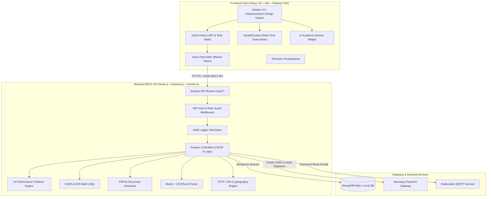
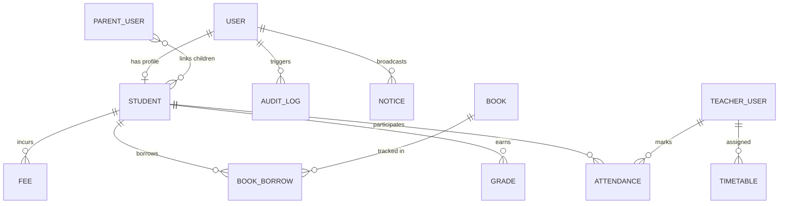

<div align="center">

# 🎓 CampusLedger
### Modern Academic Management & Institutional Operating System (v1.2.0)

[-61DAFB?logo=react&logoColor=black&style=for-the-badge)](https://reactjs.org/)
[](https://tailwindcss.com/)
[](https://nodejs.org/)
[](https://socket.io/)
[](https://www.mongodb.com/)
[](https://razorpay.com/)
[](LICENSE)

<p align="center">
  A production-grade, full-stack collegiate administration portal engineered to streamline academic record-keeping, attendance tracking, marks grading, online fee settlements, circular broadcasts, <strong>AI-driven performance diagnostics</strong>, <strong>real-time push notifications</strong>, <strong>library cataloging</strong>, and document generation with strict <strong>Role-Based Access Control (RBAC)</strong>.
</p>

[Key Features](#-key-features--role-capabilities) • [AI & Real-Time Modules](#-ai-diagnostics--real-time-infrastructure) • [System Architecture](#-system-architecture) • [Demo Logins](#-demo-accounts--quick-switchers) • [API Documentation](#-complete-api-reference) • [Setup Guide](#-installation--getting-started)

</div>

---

## 📑 Table of Contents

1. [Executive Summary](#-executive-summary)
2. [What's New in v1.2.0](#-whats-new-in-v120)
3. [Demo Accounts & 1-Click Role Switchers](#-demo-accounts--quick-switchers)
4. [Key Features & Role Capabilities](#-key-features--role-capabilities)
5. [AI Diagnostics & Real-Time Infrastructure](#-ai-diagnostics--real-time-infrastructure)
6. [System Architecture & Data Flow](#-system-architecture)
7. [Technology Stack](#-technology-stack)
8. [Database Models & Entity Relationships](#-database-models--schema-specs)
9. [Mathematical Algorithms & Business Logic](#-core-algorithms--business-logic)
10. [Complete API Reference](#-complete-api-reference)
11. [Project Directory Structure](#-project-directory-structure)
12. [Installation & Getting Started](#-installation--getting-started)
13. [Environment Variables Specification](#-environment-variables-specification)
14. [Security & Compliance Hardening](#-security--compliance-hardening)

---

## 🌟 Executive Summary

**CampusLedger** digitizes the entire lifecycle of collegiate administration into a centralized, real-time web portal. Rather than a basic CRUD application, CampusLedger provides:

- 🛡️ **Multi-Tier RBAC**: Isolated dashboards and route guards for **Admins**, **Teachers**, **Students**, and **Parents**.
- 🤖 **AI Performance Diagnostic Engine**: Predicts final GPA, backlog risks, and prescribes personalized study roadmaps.
- ⚡ **Real-Time Push Notifications (Socket.io)**: Live floating toasts for notices and grade releases without page refreshing.
- 📚 **Library & Resource Center**: Book cataloging, stack locations (`Stack CS-101`), and 1-click reservations.
- 🔒 **Two-Factor Authentication (2FA)**: Time-based One-Time Password (TOTP) protection via Google Authenticator & Authy.
- 📊 **Automated Academic Metrics**: Real-time 10-point scale GPA / CGPA computation and `<75%` low-attendance warning triggers.
- 💳 **Cryptographic Payment Gateway**: Server-side HMAC-SHA256 signature verification for Razorpay fee settlements.
- 📄 **Programmatic PDF Documents**: Server-side rendering with PDFKit for official ID Cards and Academic Report Cards.
- 📁 **High-Throughput Data Ingestion**: Multer + stream parsing for bulk CSV/Excel student rosters.
- 📜 **Security Governance**: Immutable audit logging recording who performed create, edit, or delete actions across records.

---

## 🚀 What's New in v1.2.0

| Module | Purpose & Capabilities |
| :--- | :--- |
| **🤖 AI Study Advisor** | Server-side analytical engine evaluating attendance trajectories and exam marks to forecast risk tiers (`High Risk`, `Moderate Watch`, `Distinction`) and prescribe targeted study interventions. |
| **⚡ WebSockets Alerts** | Integrated `socket.io` broadcasting live campus circulars, published examination results, and attendance alerts to active browser sessions with floating toasts. |
| **📚 Library Catalog** | Full-fledged book repository with categories, shelf tracking, available copies counter, borrowing history, and return management. |
| **🔒 2FA Security Modal** | QR-code scanner and TOTP verification for administrative accounts using `speakeasy` and `qrcode`. |

---

## ⚡ Demo Accounts & Quick Switchers

The portal at `http://localhost:5173/login` includes **1-Click Autofill Demo Buttons** for instant evaluation across all roles:

| Role | Demo Email | Password | Primary Capabilities & Access Scope |
| :--- | :--- | :--- | :--- |
| **👑 Admin** | `admin@campusledger.edu` | `Admin123!` | Institutional analytics, user provisioning, student directory, CSV bulk import, fee reconciliation, library management, audit trail |
| **👨‍🏫 Teacher** | `dr.sharma@campusledger.edu` | `Teacher123!` | Class rosters, interactive roll-call attendance register, marks entry with automatic 10-point GPA, library center |
| **🎓 Student** | `alex.morgan@campusledger.edu` | `Student123!` | **AI Performance Advisor**, attendance analytics with `<75%` warnings, transcripts, Razorpay payments, book reservations, PDF downloads |
| **👨‍👩‍👧 Parent** | `parent.morgan@campusledger.edu` | `Parent123!` | Multi-child switcher tabs, **AI Advisor for child**, linked student attendance reports, academic transcripts, and fee status |

---

## 🤖 AI Diagnostics & Real-Time Infrastructure

### 1. Server-Side Proxy Engine
All AI analytical forecasting and heuristic evaluations execute strictly on the Node.js backend (`backend/utils/performancePredictor.js`). This ensures zero client-side key leakage, total privacy of academic scoring algorithms, and autonomous local execution without requiring third-party billing keys.

### 2. Real-Time WebSockets Architecture
Using `Socket.io`, connected clients receive non-intrusive floating toasts for:
- 📢 Campus notices broadcasted by Dean / Administration.
- 📊 Published examination results and marks modifications.
- 📚 Book availability updates in the library catalog.

---

## 🏗️ System Architecture



---

## 💻 Technology Stack

```
+-------------------------------------------------------------------------+
|                              CAMPUSLEDGER                               |
+-------------------+--------------------+--------------------------------+
| LAYER             | TECHNOLOGY         | PURPOSE                        |
+-------------------+--------------------+--------------------------------+
| Frontend Framework| React 18 (Vite)    | High-performance SPA           |
| Styling & UI      | Tailwind CSS       | Responsive dark design system  |
| Real-Time Alerts  | Socket.io-client   | Live event toast notifications |
| Icons & Visuals   | Lucide-React       | Modern iconography             |
| Analytics         | Recharts           | Interactive data visualizers   |
| Backend Runtime   | Node.js            | Asynchronous server runtime    |
| API Framework     | Express.js         | Modular RESTful endpoints      |
| Real-Time Server  | Socket.io          | Bi-directional event stream    |
| Database          | MongoDB (Mongoose) | Document store & indexing      |
| Authentication    | JWT & bcryptjs     | Stateless authorization        |
| 2FA Security      | Speakeasy, QRCode  | TOTP Authenticator app sync    |
| PDF Engine        | PDFKit             | Server-side vector PDFs        |
| Payments          | Razorpay SDK       | Card/UPI gateway integration   |
| File Processing   | Multer, csv-parse  | Bulk Excel/CSV onboarding      |
+-------------------+--------------------+--------------------------------+
```

---

## 🗄️ Database Models & Schema Specs



---

## 📡 Complete API Reference

### 🔐 Authentication & Security
| Method | Endpoint | Authorization | Description |
| :--- | :--- | :--- | :--- |
| `POST` | `/api/auth/login` | Public | Authenticate credentials & return JWT |
| `POST` | `/api/auth/register` | Admin | Provision a new teacher, student, or parent |
| `GET` | `/api/auth/me` | Authenticated | Retrieve current session payload |
| `GET` | `/api/auth/users` | Admin | Paginated user directory with search/role filters |
| `PATCH`| `/api/auth/users/:id/toggle-status`| Admin | Activate or deactivate user accounts |
| `POST` | `/api/2fa/generate` | Authenticated | Generate TOTP secret & QR code data URL |
| `POST` | `/api/2fa/verify` | Authenticated | Verify 6-digit TOTP code and enable 2FA |

### 🤖 AI Academic Insights & Scholar Records
| Method | Endpoint | Authorization | Description |
| :--- | :--- | :--- | :--- |
| `GET` | `/api/grades/:studentId/ai-insights` | Admin, Teacher, Student, Parent | **AI Academic Performance & Risk Diagnostics** |
| `GET` | `/api/students` | Admin, Teacher | List students with search, sem, & dept filters |
| `POST` | `/api/students` | Admin | Enroll single scholar & provision user |
| `POST` | `/api/students/import` | Admin | Multi-part upload for CSV/XLSX bulk ingestion |
| `GET` | `/api/students/:id/report-card` | Admin, Teacher, Student, Parent | Stream generated PDF official Report Card |
| `GET` | `/api/students/:id/id-card` | Admin, Student (own) | Stream generated PDF official Student ID Card |

### 📚 Library & Resource Management
| Method | Endpoint | Authorization | Description |
| :--- | :--- | :--- | :--- |
| `GET` | `/api/library/books` | Authenticated | Search library catalog by title/author/category |
| `POST` | `/api/library/books` | Admin | Catalog a new academic book |
| `POST` | `/api/library/borrow` | Student, Admin | Reserve / borrow physical book copy |
| `POST` | `/api/library/return/:borrowId`| Student, Admin | Return borrowed book and update stock |
| `GET` | `/api/library/my-books` | Student, Admin | List active borrowed books for student |

---

## 🛠️ Installation & Getting Started

### 1. Clone the Repository
```bash
git clone https://github.com/amruthck177/Student_management_system.git
cd Student_management_system
```

### 2. Backend Setup
```bash
cd backend
npm install
cp .env.example .env
npm run seed      # Populates database with sample users, grades, library books
npm run dev       # Starts server on http://localhost:5000
```

### 3. Frontend Setup
```bash
cd frontend
npm install
npm run dev       # Starts UI on http://localhost:5173
```

---

## 📄 License

Distributed under the **MIT License**. See the [LICENSE](LICENSE) file for more information.

<div align="center">
  <sub>CampusLedger • Built for Modern Collegiate Institutions</sub>
</div>
